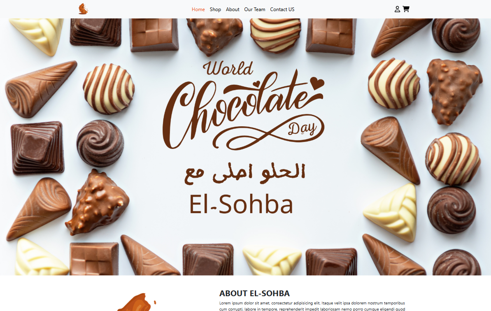

# 🍫 El-Sohba Chocolate – Modern Chocolate Store Website

## 📋 Project Overview
**El-Sohba Chocolate** was developed as a university project by our team to create an online platform for exploring and ordering chocolates. The project focuses on building a user-friendly interface and organizing chocolate products in a simple and clear way.

The main goal was to practice web development skills and teamwork while creating a functional and visually organized project.

---

## 🚀 Live Demo
🔗 [View Project Live](https://ahmednaderhq.github.io/El-Sohba-Chocolate/)

---

## 📷 Preview
  

---

## 🎯 Key Features

### 🏠 Home Page
- Display of featured products  
- About Us section  
- Meet the Team section  
- Contact form  
- Quick shopping cart (Offcanvas)

### 🛒 Shopping System
- Full shop page with all products  
- Interactive shopping cart  
- Product details page  
- Checkout page  
- Quantity management system

### 👥 User System
- Login page  
- Register page  
- Basic authentication system

---

## 🛠️ Technologies Used

**Frontend:**
- HTML5 – Structure  
- CSS3 – Styling & Layout  
- JavaScript (ES6+) – Interactivity  
- Bootstrap 5 – Responsive design  
- Font Awesome – Icons  

**Libraries:**
- jQuery 3.6.0 – JavaScript library  
- Bootstrap Bundle – Interactive components  

---

## 📂 Project Structure

```
project/
├── 📄 index.html 
├── 📄 shop.html    
├── 📄 product.html         
├── 📄 cart.html   
├── 📄 checkout.html     
├── 📄 about.html           
├── 📄 our-team.html        
├── 📄 contact.html        
├── 📄 login.html        
├── 📄 register.html     
├── 🖼️ favicon.ico          
└── 📁 layout/             
    ├── 📁 css/              
    │   ├── bootstrap.min.css
    │   ├── all.min.css    
    │   └── front-end-en.css 
    ├── 📁 js/              
    │   ├── jquery-3.6.0.min.js
    │   ├── bootstrap.bundle.min.js
    │   ├── all.min.js        
    │   └── front-end.js      
    ├── 📁 images/            
    │   ├── [product images]
    │   ├── [team member photos]
    │   └── [brand assets]
    └── 📁 webfonts/           
```

## 👨‍💻 Development Team

- Ahmed Ismail – [LinkedIn](https://www.linkedin.com/in/ahmed-ismail-a03185255/) | [GitHub](https://github.com/AhmedMohIsmail)  
- Ahmed Abdullah – [LinkedIn](https://www.linkedin.com/in/ahmed-abdullah-877981244) | [Facebook](https://www.facebook.com/profile.php?id=100082720839872)  
- Mazen Alasas – [LinkedIn](https://www.linkedin.com/in/mazen-ahmed-772831244/) | [GitHub](https://github.com/mazen-alasas)  
- Abdelrahman Refaat – [LinkedIn](https://www.linkedin.com/in/abdelrahman-elgamal-b5b8832a3/) | [GitHub](https://github.com/AbdoElgamal)  
- Ahmed Nader – [LinkedIn](https://www.linkedin.com/in/ahmed-nader-8a0a2529a) | [GitHub](https://github.com/AhmedNaderHQ)  
- Abdulrahman Mohamed – [LinkedIn](https://www.linkedin.com/in/abdo-saad-7a4b932a2/)  
- Ziad Mohamed – [LinkedIn](https://www.linkedin.com/in/ziad-mohamed-759a73240)  
- Ahmed Elsherbiny – [LinkedIn](https://www.linkedin.com/in/ahmed-elsherbiny-/) | [GitHub](https://github.com/AhmedElsherbiny2)  
- Abdulrahman Adel – [LinkedIn](https://eg.linkedin.com/in/abdulrahman-abdelazez-36808020a)  
- Abdulrahman Elmahdy – [Facebook](https://www.facebook.com/profile.php?id=100058236901493)  

---

## 📱 Responsive Design
- Desktop 💻  
- Tablet 📱  
- Mobile 📲  
